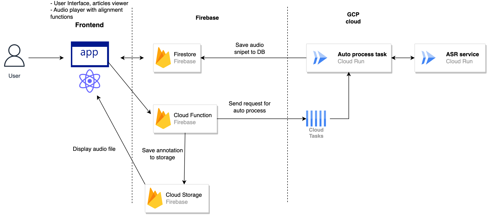
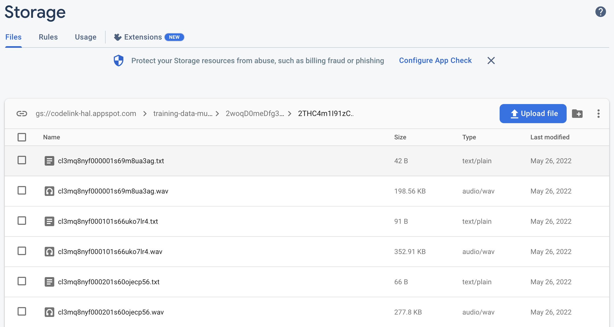

# TTS annotation tool
This is a tool for annotating text-to-speech (TTS) data for training. It makes your text - audio alignment easier by providing a simple interface to upload the audio and then create audio - text pair. Below is the workflow:
1. Upload the audio file
2. Input the long text
3. System will process audio and split into small chunks
4. An ASR (automatic speech recognition) service will assign suitable text to each chunk
5. User can edit the text and align audio to fine tune the annotation
6. The result will be saved in Firebase storage with the same name audio - text pair

## Project architecture
The project is built using ReactJS and Firebase. The app is deployed on Firebase hosting and the data is stored in Firebase storage. Beside that the project uses Firebase Cloud Function for some services and Google Cloud Platform for ASR service.

Architecture diagram:

## How to run the project
### Setup Firebase
To run the project you need to set up a Firebase project and Firebase storage. 
Please refer to the [Firebase docs](https://firebase.google.com/docs?authuser=0&hl=en) for more information.

1. Create a Firebase project
2. Create a Firebase storage
3. Create a Firebase Cloud Function

### Setup Google Cloud Platform
To run the project you need to set up a Google Cloud Platform project.

### Deploy ASR tasks and Services to Cloud Run
1. Deploy the ASR service to Cloud Run 
2. Obtain any ASR model from Hugging Face, in this case we use a wav2vec2 model. You can also use other models if you want.
3. Package the model and put it to a folder `model` in `services/audio-processing` folder
4. Deploy the service to [Cloud Run](https://cloud.google.com/run/docs/quickstarts/build-and-deploy/deploy-python-service)
5. Obtain the URL of the service. It will be used in the next step

6. Create a Cloud [task queue](https://cloud.google.com/tasks/docs/creating-queues) in GCP
7. Create a Service account for Cloud task queue and give it permission to access Cloud Tasks Queue
8. Put `task-cert.json` file in `services/audio-processing-task` folder
9. Add the task `QUEUE_NAME` and `PROJECT_ID` to `services/audio-processing-task/.env` file
10. Add Firebase service account key to `services/audio-processing-task` folder so that the service can access Firestore DB and Firebase storage
11. Deploy the service to Cloud Run
12. Obtain the URL of the service. It will be used in the next step

### Deploy Firebase Cloud Function and Firebase Hosting
1. Reference to the [Firebase docs](https://firebase.google.com/docs?authuser=0&hl=en) for more information.
2. Add Firebase service account key to `web-ui/functions` folder so that the service can access Firestore DB and Firebase storage
3. Add URL obtained from last step to the cloud function ENV `functions.config().preprocesssourceaudio.processingurl`
4. Deploy the cloud function to Firebase and get the URL of the service. Run `firebase deploy --only functions`
5. Get `CREATE_SNIPPET_URL` from the functions put `services/audio-processing-task/.env` then redeploy the ASR tasks to Cloud Run 
6. Build and deploy the web app to Firebase hosting `web-ui/web`. See the README in `web-ui/web` for more details

### App example screen record and use case
Check out the video [here](https://drive.google.com/file/d/1Fy5ggLeR3F1dRJ_DAhVyBrHdECoXQqdt/view?usp=share_link)
And the `screenshot` folder for more details

### Example
After processing the audio, the result after reading will be like this:
- [Audio](https://drive.google.com/file/d/1w60td0FO5AnC88cc0maUydnsw5q3zWL0/view)
- Text: "thế là sáng hôm sau, cái tin tôi về đến cổng còn hỏi thăm đường đã lan ra khắp xóm"
You can also see the result in the app and in Firebase storage.

## Released dataset using this tool
We have released a Vietnamese dataset using this tool. You can find it [here](https://github.com/CodeLinkIO/vietnamese-voice-dataset)
This is a dataset for Vietnamese TTS. It contains 10000 audio - text pairs. 
The audio is recorded by a professional voice actor. The text is collected from news articles from the internet. 
The dataset is used for training a TTS model for Vietnamese language.

## Application
We have trained a Vietnamese TTS model using with the help of this tool for preparing the dataset. This model is used at https://baonoi.ai to generate voice for news articles. It is available [here](https://baonoi.ai/)
